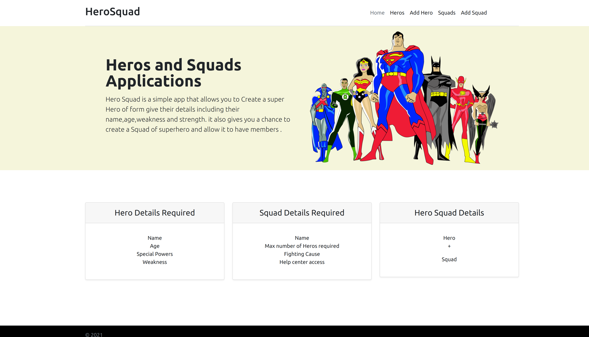

# HeroSquad Application
---
## Project Description
GHero Squad is a simple app that allows you to Create a super Hero of form give their details including their name,age,weakness and strength. it also gives you a chance to create a Squad of superhero and allow it to have members .

# ScreenShort 
](img.png)
## Application Link 
[link](https://vicky-hero-squad.herokuapp.com/)

## Author Information
[Victoria Okumu](https://github.com/vokumu)
# Setup Instructions
To start using this project use the following:
1. Make sure you installed java application

2. install the following java requirements JUnit, intellij, SDK, JDK.

3. git clone

4. Navigate into the hero-squad directory - cd Wildlife-tracker-project /Navigate into the src/main/java/App.java and click run in intellij.

5. Go to your browser and type localhost:4567

## Technologies Used
* JDK
* Junit
* Java
* SDK
* IntellijIDEA
* Bootstrap
* Gradle
* maven
* Spark
* CSS
# Contact Information
- Email <victoriawasonga@gmail.com>

# Copyright  & License
## Copyright
        *AngularJs
        *Bootstrap

## License
[MIT](LICENSE)
Permission is hereby granted, free of charge, to any person obtaining a copy of this software and associated documentation files (the "Software"), to deal in the Software without restriction, including without limitation the rights to use, copy, modify, merge, publish, distribute, sublicense, and/or sell copies of the Software, and to permit persons to whom the Software is furnished to do so, subject to the following conditions:
The above copyright notice and this permission notice shall be included in all copies or substantial portions of the Software.
